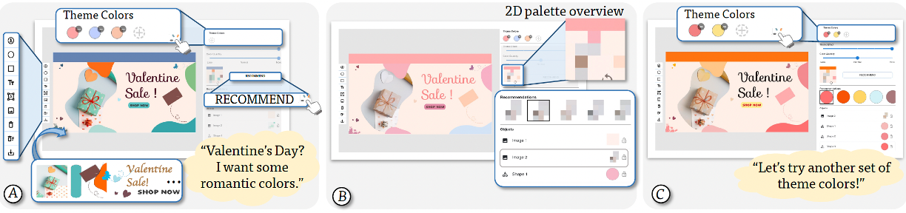

# De-Stijl

This is the code repository for the paper [De-Stijl: Facilitating Graphics Design with Interactive 2D Color Palette Recommendation](https://dl.acm.org/doi/10.1145/3544548.3581070) (CHI'23)



## Steps to run the code
```
git clone https://github.com/Xinyu-Shi/De-Stijl.git
cd de-stijl
```

### Backend Preparation
```
cd De-Stijl-backend
```

1. Create a new conda env
```
conda create -n de_stijl python==3.8
conda activate de_stijl
```

2. Install pytorch 
```
pip install torch==1.8.2+cu111 torchvision==0.9.2+cu111 torchaudio==0.8.2 -f https://download.pytorch.org/whl/lts/1.8/torch_lts.html
```

3. Install other dependencies
```
pip install -e .
```

4. Download [checkpoints](https://drive.google.com/drive/folders/1RTfuyj43AxzwISzGUgJQaVlJu9OTdiaZ?usp=sharing), config your path at `./src/de_stijl/backend/modules/options --ckpt_dir`

5. Run the interpolator
```
cd ./src/de_stijl/backend/modules
python interpolator.py --ckpt_dir YOUR/CHECKPOINTS/PATH
```

### Run backend
```
cd 
python api.py 
```

### Frontend Preparation
1. Go to the front-end directory
```
cd De-Stijl-frontend/app
```
2. Build node modules
```
npm install
(if failed, try: npm install --legacy-peer-deps)
```
3. Run the frontend
```
npm start
```

## Cite
```
@inproceedings{10.1145/3544548.3581070,
    author = {Shi, Xinyu and Zhou, Ziqi and Zhang, Jing Wen and Neshati, Ali and Tyagi, Anjul Kumar and Rossi, Ryan and Guo, Shunan and Du, Fan and Zhao, Jian},
    title = {De-Stijl: Facilitating Graphics Design with Interactive 2D Color Palette Recommendation},
    year = {2023},
    isbn = {9781450394215},
    publisher = {Association for Computing Machinery},
    address = {New York, NY, USA},
    url = {https://doi.org/10.1145/3544548.3581070},
    doi = {10.1145/3544548.3581070},
    articleno = {122},
    numpages = {19},
    location = {Hamburg, Germany},
    series = {CHI '23}
}
```

